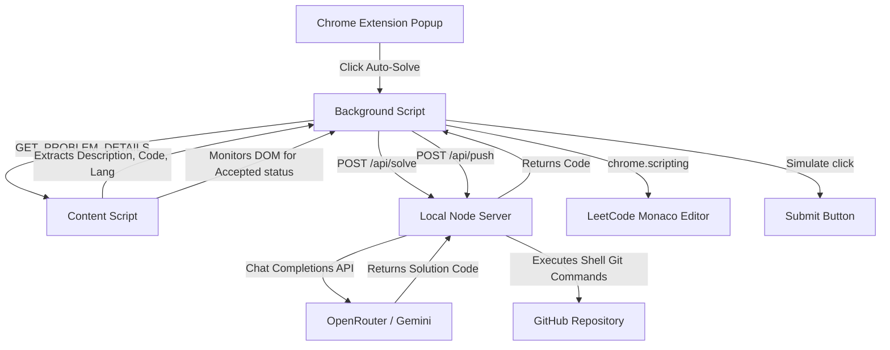

# Project Documentation: LeetCode Flow AI Solver & GitHub Backup

---

## 1. Introduction
In competitive programming and software engineering preparation, LeetCode is one of the most widely used platforms. However, keeping track of solved problems, logging focus time, and maintaining a repository of clean solutions on GitHub can be tedious. 

**LeetCode Flow** is a project built to automate this workflow. It consists of a Chrome Extension interface and a local Node.js backend server. The system automatically reads active LeetCode problems, utilizes Generative AI (via OpenRouter) to write optimal solutions, injects the code into the editor, submits it, and pushes the accepted code to a GitHub repository.

---

## 2. Objective
The primary goals of this project are:
- **Browser Automation:** Extracting active problem details (title, description, language, code template) from LeetCode dynamically.
- **AI Integration:** Leveraging LLMs (Gemini-2.5-Flash via OpenRouter) to generate correct, clean, and optimal source code solutions.
- **Editor Interaction:** Safely injecting generated code into LeetCode's Monaco Editor and auto-triggering the submit action while adhering to modern browser security guidelines (Content Security Policy).
- **Automated Version Control:** Backing up solved problems into a local and remote GitHub repository automatically upon successful submission.
- **Time Tracking:** Monitoring focus time spent on each problem to build stats and study metrics.

---

## 3. What This Does
- **Scrapes Problem Context:** When you view a LeetCode problem description, the content script extracts the metadata.
- **Visual Timer & Focus Log:** The popup logs your daily streak, tracks stats for Easy/Medium/Hard problems, and logs your solving history.
- **One-Click Auto-Solve:** Clicking the "Auto Solve & Submit" button initiates the AI solving pipeline.
- **Bypasses CSP Constraints:** Using Manifest V3's Scripting API, it writes code directly into LeetCode's Monaco Editor model.
- **Auto Git Commits:** Saves successful answers under a `solutions/` folder with proper comments (Title, Difficulty, LeetCode URL) and commits/pushes them to GitHub.

---

## 4. What I Did (Implementation Steps)
To build this automation framework, I completed the following tasks:
1. **Designed local API endpoints:** Created the server routing in `server.js` using Node's native HTTP library, implementing body parser streams and CORS headers to allow cross-origin requests from the extension.
2. **Integrated OpenRouter completions:** Implemented the `POST /api/solve` route to format prompts, handle authorization, define a `max_tokens: 2048` limit to avoid credit exhaustion, and sanitize the resulting text (stripping markdown backticks).
3. **Built the Git execution engine:** Added shell execution functions to write solution files and run standard shell commands (`git add`, `git commit`, `git push`) asynchronously.
4. **Enhanced Extension settings:** Programmed a slide-open configuration panel to input API keys and choose between local git syncing or direct GitHub REST API commits.
5. **Solved Content Security Policy (CSP) blocking:** Replaced unsafe inline script injections in the content script with Chrome's native `chrome.scripting.executeScript` running inside the page context (`MAIN` world) to safely interface with LeetCode's global `window.monaco` object.
6. **Eliminated asynchronous race conditions:** Initialized the timer objects synchronously on extension launch to prevent message listeners from reading undefined properties.

---

## 5. Technical Explanation
The system operates as a loop between three main layers:

1. **Extraction:** The content script parses LeetCode's DOM structure looking for classes like `.text-title-large` or `[data-track-load="description_content"]` to build the context.
2. **Completions Request:** The local server queries the OpenRouter API. It maps the programming language to format-specific instructions (e.g. asking for clean Python functions or SQL queries) and sets the maximum tokens to ensure fast response.
3. **Execution & Submission:** The background script injects the code into the tab. It calls `monaco.editor.getModels()` and updates the text buffer, then clicks the submit selector.
4. **Validation & Sync:** The observer detects when the result changes to "Accepted". It fetches the code, maps it to the correct file extension, and saves/commits the code.

---

## 6. Tech Stack
- **Extension Core:** Manifest V3, Content Scripts, Background Service Workers, HTML5, CSS3, TypeScript.
- **Build Tool:** Vite (for modular bundling and optimization).
- **Backend API Server:** Node.js (built-in `http`, `https`, `fs`, `child_process`).
- **AI completions:** OpenRouter API (serving `google/gemini-2.5-flash`).
- **Version Control:** Git, GitHub API, SSH/HTTPS Credential Helpers.
